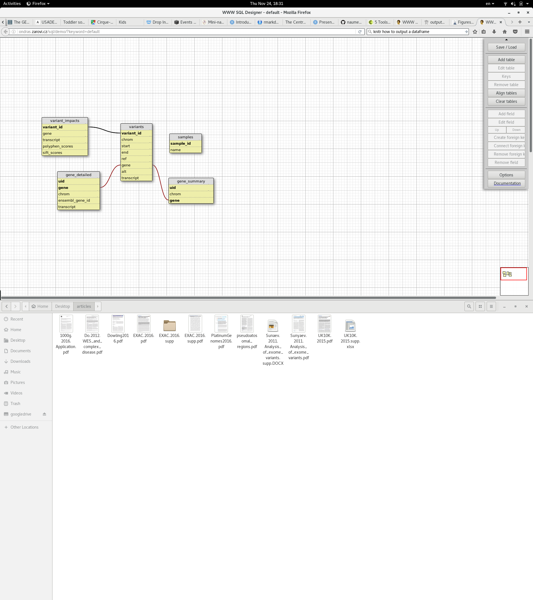

```{r setup, include=FALSE}
library(knitr)
library(grid)
#knitr::opts_chunk$set(echo = T)
```

## 'Lazy bioinformatics' approach

```{r echo=F}
grid.roundrect(width=.25,height=.25,x=0.25,y=0.75)
grid.text("Raw sequencing \n data",x=0.25,y=0.75)

grid.move.to(0.4, .75)
grid.line.to(0.6, .75,arrow = arrow(angle=15))

grid.roundrect(width=.25,height=.25,x=0.75,y=0.75)
grid.text("Data processing \n with pipelines",x=0.75,y=0.75)

grid.move.to(0.75, .6)
grid.line.to(0.75, .4,arrow = arrow(angle=15))

grid.roundrect(width=.25,height=.25,x=0.75,y=0.25)
grid.text("Analysis in R",x=0.75,y=0.25)

grid.move.to(0.6, .25)
grid.line.to(0.4, .25,arrow = arrow(angle=15))

grid.roundrect(width=.25,height=.25,x=0.25,y=0.25)
grid.text("Reading & Writing",x=0.25,y=0.25)

grid.move.to(0.25, .4)
grid.line.to(0.25, .6,arrow = arrow(angle=15))
```

Only possible for simple analyses: Variants in WES, DE and variants in RNA-seq

## What could we say about this variant?

### chr19 38976331 G A

## chr19 38976331 G A
### What should we figure out first?

* Species: _H.sapiens_, _Mus musculus_, _Drosophila melanogaster_? 

### What should we figure out second?

* https://www.ncbi.nlm.nih.gov/grc/human
* http://grch37.ensembl.org
* http://www.ensembl.org/index.html

## Ensembl Variant Effect Predictor

http://grch37.ensembl.org/Homo_sapiens/Tools/VEP

### Other options
* SNPeff
* Annovar

## dbSNP
### Look for rs146504767
https://www.ncbi.nlm.nih.gov/projects/SNP/

##Human Gene Mutation Database (HGMD)
* RYR1
* CM104331
* http://www.hgmd.cf.ac.uk
* Pro version is much better but pricy.

## What if we have more than one variant?

* [Stitziel et al. Computational and statistical approaches to analyzing variants identified by exome sequencing](https://genomebiology.biomedcentral.com/articles/10.1186/gb-2011-12-9-227)
* [Exome aggregation consortium](http://www.nature.com/nature/journal/v536/n7616/full/nature19057.html)
* clunky vcf file

~~~
1	15211	.	T	G	1007.35	PASS AB=0;ABP=0;AC=2;AF=1;AN=2;ANN=G|
downstream_gene_variant|MODIFIER|DDX11L1|ENSG00000223972|transcript|
ENST00000456328|processed_transcript||n.*802T>G|||||802|,G|downstream_gene_variant|
MODIFIER|DDX11L1|ENSG00000223972|transcript|ENST00000515242|transcribed_unprocessed_pseudogene|
|n.*799T>G|||||799|,G|downstream_gene_variant|MODIFIER|DDX11L1|ENSG00000223972|transcript|
ENST00000518655|transcribed_unprocessed_pseudogene||n.*802T>G|||||802|,G|downstream_gene_variant|
MODIFIER|DDX11L1|ENSG00000223972|transcript|ENST00000450305|transcribed_unprocessed_pseudogene|
|n.*1541T>G|||||1541|,G|intron_variant|MODIFIER|WASH7P|ENSG00000227232|transcript|ENST00000438504
|unprocessed_pseudogene|10/11|n.1248-173A>C||||||,G|intron_variant|MODIFIER|WASH7P|ENSG00000227232
|transcript|ENST00000541675|unprocessed_pseud>ogene|7/8|n.881-173A>C||||||,G|intron_variant|MODIFIER
|WASH7P|ENSG00000227232|transcript|ENST00000423562|unprocessed_pseudogene|8/9|n.1134-173A>C|||||
|,G|intron_variant|MODIFIER|WASH7P|ENSG00000227232>|transcript|ENST00000488147|unprocessed_pseudogene|9/10|n.1220-173A>C||||||,G|intron_variant|MODIFIER|WASH7P|ENSG00000227232|transcript
|ENST00000538476|unprocessed_pseudogene|11/12|n.1453-173A>C|||||
|;AO=50;CALLERS=freebayes,samtools;CIGAR=1X;DP=52;DPB=52;DPRA=0;EPP=14.1282;EPPR=7.35324;GTI=0;
LEN=1;MEANALT=1;MQM=25.2;MQMR=14;NS=1;NUMALT=1;ODDS=67.5514;PAIRED=0.98;PAIREDR=1;PAO=0;PQA=0;PQR=0;
PRO=0;QA=1735;QR=70;RO=2;RPL=23;RPP=3.70517;RPPR=7.35324;RPR=27;RUN=1;SAF=14;SAP=24.0302;SAR=36;
SRF=0;SRP=7.35324;SRR=2;TYPE=snp;technology.illumina=1	GT:GQ:DP:RO:QR:AO:QA:GL	1/1:160:52:2:70:50:1735:-105.084,-13,0
~~~

## How to organize this information in a neat format?

* ### Use dataframe in R
* ### or even a database
* #### https://gemini.readthedocs.io/en/latest/
* #### Paila U, Chapman BA, Kirchner R, Quinlan AR (2013)
GEMINI: Integrative Exploration of Genetic Variation and Genome Annotations.
PLoS Comput Biol 9(7): e1003153. doi:10.1371/journal.pcbi.1003153 cited by 74

## What is database?

- Database is a collection of related dataframes (tables);
- GEMINI uses SQLite database which does not require database server or database engine;
- database slang:
    + dataframe = table
    + column = field
    + select * from [table_name] where [condition];
- Web Interface to plot database schemas:
  http://ondras.zarovi.cz/sql/demo/?keyword=default

## Gemini database schema  



## How to load your variants into the GEMINI database?

- Ask your bioinformatics provider to send results in the GEMINI format;
- Ask CCM to convert vcf2gemini;
- Convert
    + gemini load (linux);
    + vcf2db.py 
- Use bcbio pipeline system – it outputs GEMINI and vcf.

## Example queries

select gene,transcript from gene_detailed where gene='AGRN';
select variant_id,gene,transcript from variant_impacts where variant_id=2;

## Additional columns not present in GEMINI

- UCSC hyperlink
- OMIM gene description (registration required)
- Orphanet status
- exac pLi score
- exec missense score
- phastcons score
- imprinting status
- information from HGMD database (public version is unusable, pro version is pricy)
- pseudoatosomal gene

## Gemini development

* compressed blob issue - loader
* multiuser : mysql, postgres
* additional fields
* https://github.com/arq5x/gemini
* huge size of sqlite3 - autovacuum.

## Are you ready to analysis like ExAC?

## Bcbio pipelines

- open source, community supported
- developed mainly by Harvard T.Chan Medical School Bioinformatics Core
- validated
- well documented
- Pipelines
```{r pipelines,echo=F}
pipelines=data.frame(c("variant calling","cancer","structural variant calling","RNA-seq","smallRNA-seq","ChIP-seq"))
kable(pipelines)
```
- Resources
    + https://bcbio-nextgen.readthedocs.io/en/latest/
    + https://github.com/chapmanb/bcbio-nextgen
    + https://bcb.io